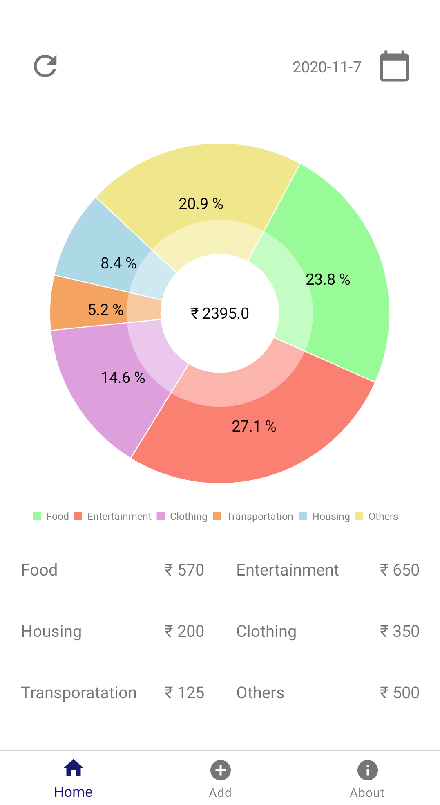
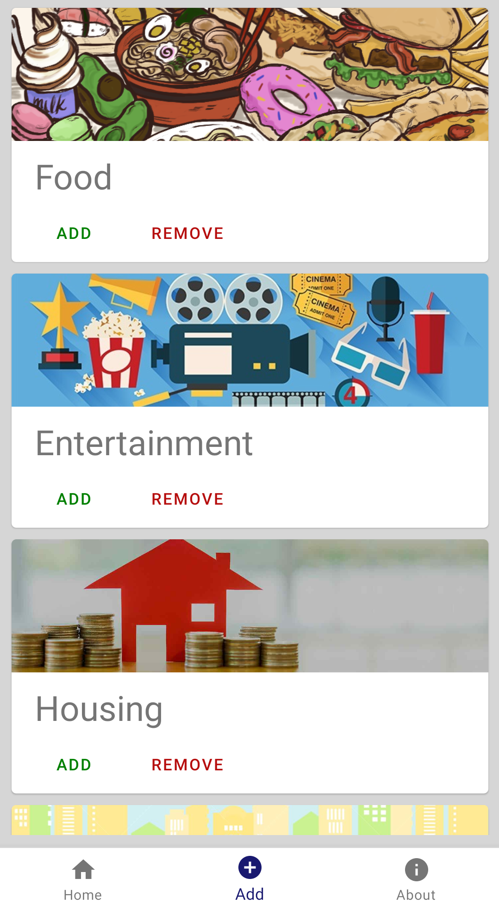
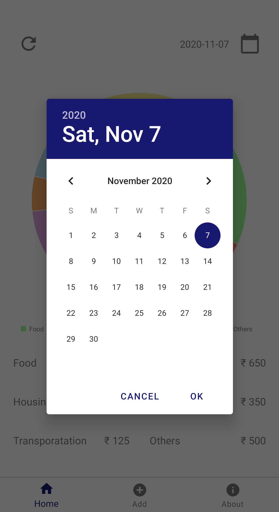
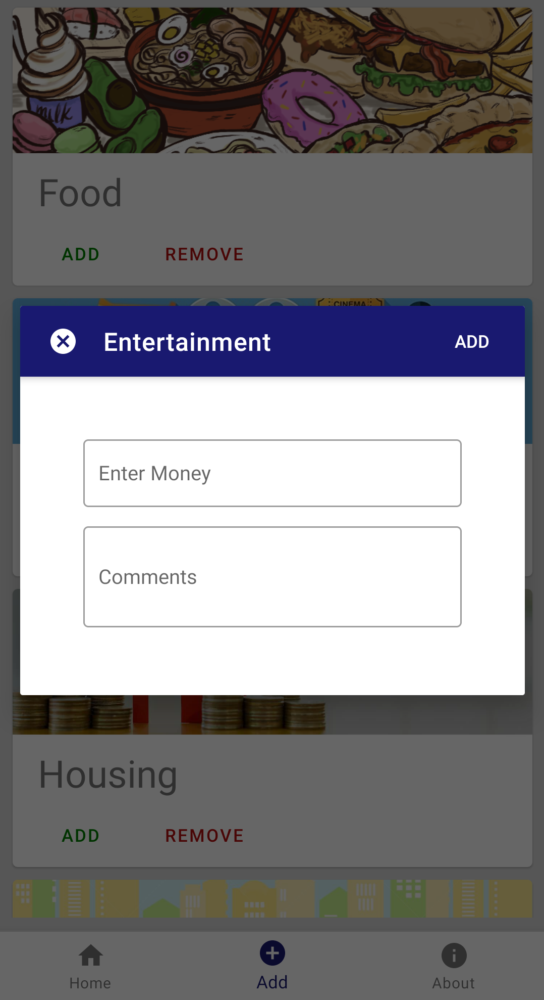

# Expense Manager
**Basic app to manage daily expenses for Android**

## Features
* Expense manager uses the Room persistence library for data storage
* MPAndroidChart is used to represent the expense data
* Simple user interface
* User can enter their expenses into different categories
* Date picker is used to see past data

### APK
Download apk file here [Expense Manager](https://github.com/Sureshb97/Expense-Manager/releases/download/v1.0.2/app-release.apk )

## Screenshots
| | | | |
|:---:|:---:|:---:|:---:|

### License

* This project is licensed under The GNU General Public License v3.0,which can be found [here](https://github.com/Sureshb97/Expense-Manager/blob/master/LICENSE.md)
 
